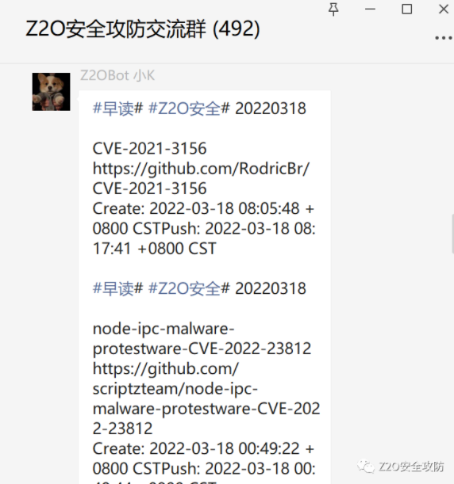

# 通过dcerpc和ntlmssp获取Windows远程主机信息

### 成果

首先看一下成果，通过DCERPC附带NTLMSSP，可以获取目标的哪些信息

如上我们可以知道通过，通过DCERPC协议的ping附带NTLMSSP 可以获取到目标的版本号主机名，域名，DNS等信息。

### 初衷

想自己实现一下，，同时因为通过rpc进行探测的工具，大部分都是依托impacket来实现，而实战中通过挂代理进行内网探测速率和准确度都比较低，所以最好的方法是将脚本放到目标主机上，来进行内网探测信息收集，所以本文关注的点是想办法脱离impacket，在Socket RAW上的实现，这样能够减小工具的体积，并且其他语言也能够轻松复刻整个过程，便于应用到实战中。  

### 协议介绍-RPC

RPC（Remote Procedure Call）远程过程调用协议，一种通过网络从远程计算机上请求服务，而不需要了解底层网络技术的协议。RPC它假定某些协议的存在，例如TCP/UDP等，为通信程序之间携带信息数据。在OSI网络七层模型中，RPC跨越了传输层和应用层，RPC使得开发，包括网络分布式多程序在内的应用程序更加容易。

### 写成脚本

根据上面的分析，写成了多线程的脚本， 多线程实现扫描效果如下：

域内主机的话会显示域名，主机名，操作系统版本架构等信息，工作组主机则信息都是自己的主机名。

### 一起交流

感兴趣的可以关注 **Z2O安全攻防** 公众号回复“**加群**”，添加Z2OBot 小K自动拉你加入**Z2O安全攻防交流群**分享更多好东西。

团队建立了知识星球，不定时更新最新漏洞复现，手把手教你，同时不定时更新POC、内外网渗透测试骚操作。感兴趣的可以加一下。

**欢迎star:star: O(∩_∩)O**

